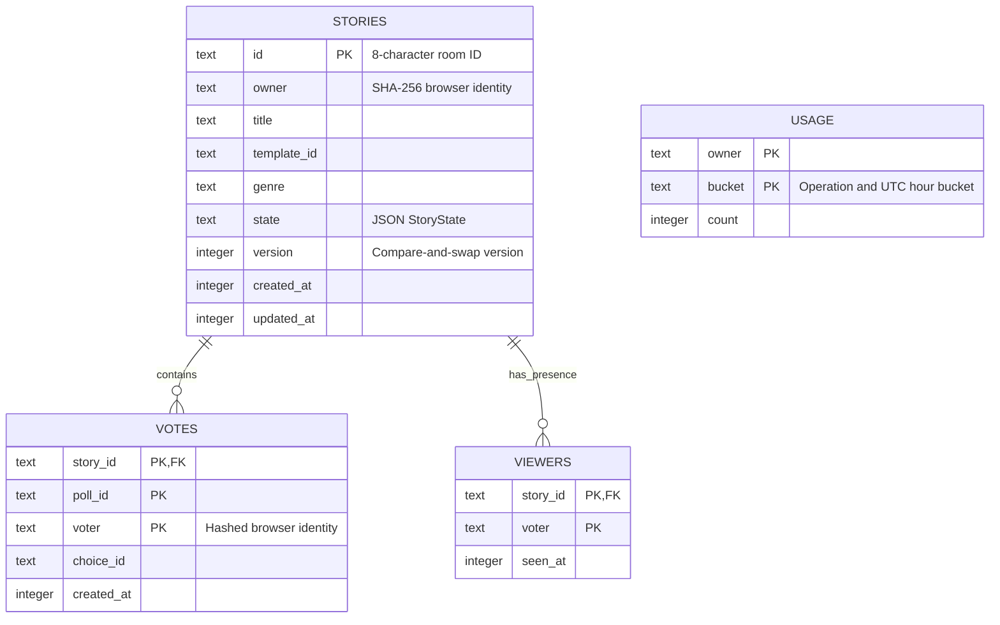
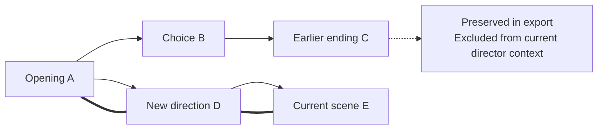

# Cutline architecture

Cutline keeps durable story state and audience voting on the server while the creator's browser controls a single live Orbis session. The video transport and the room event stream have separate lifecycles. A saved text plan can survive a video interruption.

## System boundaries

```mermaid
flowchart TB
    subgraph Browsers[Browser clients]
        Studio["Creator studio<br/>React 19 · director desk · timeline"]
        StoryHook["useStory<br/>HTTP mutations + EventSource"]
        LiveHook["useLiveVideo<br/>Reactor SDK · command lifecycle"]
        Player["Shared theater screen<br/>Source-image opening + fictional live film"]
        Audience["Audience phone<br/>Room state · choices · vote"]
        MemoryKeys["Personal keys<br/>Current tab memory only"]
    end

    subgraph Worker[Vinext / Cloudflare Worker]
        Bootstrap["Bootstrap<br/>HttpOnly cookie + public configuration"]
        API["Story API<br/>Ownership · origin checks · Zod validation"]
        SSE["SSE endpoint<br/>Bounded snapshots + presence"]
        Tokens["Creator token endpoint<br/>One model · one session · bounded duration"]
        Director["Nebius director adapter<br/>Memory + active ancestry → schema-checked beat"]
        Rehearsal["Explicit rehearsal planner<br/>Default planning mode → local beat"]
        Secrets["Server-only environment<br/>Provider keys + presenter access code"]
    end

    subgraph Storage[Cloudflare D1 / SQLite]
        Stories["stories<br/>Owner hash · JSON graph · version"]
        Votes["votes<br/>Unique story / poll / voter"]
        Viewers["viewers<br/>Last-seen timestamps"]
        Usage["usage<br/>Per-cookie + shared-provider hourly counters"]
    end

    subgraph Providers[External sponsor services]
        ReactorAPI["Reactor token service"]
        ReactorRTC["Reactor media session"]
        Orbis["Visko Orbis Dynamic<br/>Live video generation"]
        Nebius["Nebius Token Factory<br/>Structured chat completion"]
    end

    Studio --> StoryHook
    Studio --> LiveHook
    Studio --> MemoryKeys
    Studio --> Bootstrap
    Audience --> Bootstrap
    StoryHook --> API
    Audience -->|Conditional vote| API
    StoryHook --> SSE
    Audience --> SSE
    API --> Stories
    API --> Votes
    API --> Usage
    SSE --> Stories
    SSE --> Votes
    SSE --> Viewers
    API --> Director
    Director -->|Rehearsal requested| Rehearsal
    Director -->|Server-side HTTPS| Nebius
    MemoryKeys -->|Named-provider request header| API
    Secrets --> Director
    LiveHook -->|Creator cookie| Tokens
    MemoryKeys -->|Reactor key or access code| Tokens
    Secrets --> Tokens
    Tokens --> ReactorAPI
    ReactorAPI -->|Scoped JWT| Tokens
    Tokens -->|Creator only| LiveHook
    LiveHook <-->|Commands + events| ReactorRTC
    ReactorRTC <--> Orbis
    ReactorRTC -->|Video and audio tracks| Player
```



The audience is physically present at the shared screen or watching a presenter-controlled screen share. `/watch/[id]` has no Reactor client, no video track, and no session-token fetch. It is a voting companion, not a video relay. No API key is included in room snapshots or story exports.

## Runtime and deployment shape

The application uses React 19, App Router conventions, TypeScript, Tailwind CSS 4, and Vinext on Vite. Cloudflare's Vite integration exposes the D1 binding in local preview; the built artifact is a Cloudflare Worker. `.openai/hosting.json` declares `DB` and no R2 bucket. The project does not require a separate Node API service, Redis instance, or object store for story persistence.

`vite.config.ts` selects the local execution profile and includes `reactorWasm()`. The Reactor SDK imports its WASM wrapper at runtime. The build plugin copies the wrapper and binary together into `/reactor/wasm/` and rewrites the SDK import to that stable path. The generated files are ignored in Git and rebuilt from the installed SDK dependency.

The portable profile runs Vinext directly. Managed Sites preview and publication use the hosting tool's lifecycle. A local build or `npm start` is not a public deployment. `npm start` runs the built Worker locally through Wrangler and shares `.wrangler/state` with local development.

## Identity and trust

1. `GET /api/bootstrap` creates a cryptographically random 32-byte token if the browser has none. The cookie is `cutline_session`, HttpOnly, `SameSite=Lax`, and valid for 30 days; HTTPS adds `Secure`.
2. The server hashes the cookie with SHA-256 to derive the owner/voter identifier. It stores the hash, not the bearer cookie.
3. Creator requests load the story and compare its owner with that hash. Direction, token issuance, export, and deletion require ownership.
4. Audience read and vote operations require a browser identity plus the room ID. Anyone holding a room link can read its story, including its prompts and memory.
5. Mutating routes reject mismatched origins and explicit cross-site fetches. JSON request bodies are capped at 24,000 characters and action inputs are validated with Zod.

This is cookie-based ownership, not a user-account system. Clearing cookies loses access to the creator library. A room ID is an invitation mechanism, not a private-document ACL. One browser identity gets one ballot; this is not verified one-person-one-vote or Sybil resistance.

### Provider credentials

Personal keys live only in the creator component's memory. Requests use `x-reactor-key` or `x-nebius-key`; the server uses the key for the named provider. They are not written into D1, localStorage, or story exports. A page reload clears them.

Shared keys come from `REACTOR_API_KEY` or `NEBIUS_API_KEY`. Shared use requires `LIVE_ACCESS_CODE` of at least 16 characters and a matching `x-cutline-access-code` request header. The bootstrap response exposes configuration booleans and model names only. A configured flag means a value exists, not that its provider has accepted it.

Token issuance permits only the documented Orbis Dynamic or Stable model identifiers. The Reactor token request uses `expires_after: 1800`, one matching model, `max_sessions: 1`, and `max_session_duration_seconds: 900`. A short-lived JWT reaches the creator browser because the SDK needs it; it is never sent to spectator clients.

Hourly limits are keyed to the browser-derived identity: 30 story creations, 100 director actions, and 12 Reactor token requests. Shared credentials also use an atomic cross-browser counter keyed as `shared-provider`, with defaults of 12 Reactor token requests and 120 Nebius calls per hour. `SHARED_REACTOR_HOURLY_LIMIT` and `SHARED_NEBIUS_HOURLY_LIMIT` accept positive integer overrides capped at 1,000. Personal provider keys bypass the shared counter but retain the browser counter. Request caps are not dollar budgets; use provider-side spending controls for a monetary ceiling.

## Durable data model



Story JSON contains an array of beats, current scene ID, continuity memory, current poll, cosmic chapter, phase, cue metadata, and session indicators. Beats have stable UUIDs and `parentId` links. The array preserves alternate futures; `activePath()` walks only ancestors of the current scene and protects against malformed cycles.



The active director context is memory plus the final five ancestors on the current path. It does not use the last five inserted scenes, which could contain an abandoned future. Selecting a past scene changes the current pointer; the next direction creates a child of that scene. Live regeneration uses its prompt, not a saved model-state snapshot.

`direct` and `poll.apply` explicitly accept `planning: rehearsal | nebius`; omitted planning defaults to rehearsal. The client selects Nebius only when a personal Nebius key or shared Nebius configuration plus a supplied presenter code is available. Explicit Nebius mode with no usable key fails rather than silently changing the planner.

Only the current poll is embedded in `StoryState`. Votes remain in their table until the story is deleted, but exports do not promise a complete audit of every historical ballot round. They include all saved scene branches and the current poll's state/results.

## Voting transaction

```mermaid
sequenceDiagram
    participant C as Creator
    participant P as Audience phone
    participant API as Story API
    participant DB as D1
    participant N as Director adapter
    participant R as Reactor / Orbis
    C->>API: poll.open
    API->>DB: Save new poll with version check
    API-->>C: Updated story
    API-->>P: SSE snapshot with open choices
    P->>API: vote(pollId, choiceId)
    API->>DB: Conditional INSERT ... SELECT + UPSERT
    Note over DB: Require matching open poll and valid choice<br/>Unique story/poll/voter replaces prior vote
    API-->>P: Snapshot with myVote and totals
    C->>API: poll.close
    API->>DB: One CTE UPDATE freezes tallies, winner, open=false
    Note over DB: Check story version; tie follows visible choice order<br/>No positive ballots means null winner
    API-->>C: Closed story and winner
    C->>API: poll.apply
    API->>N: Winning action + continuity context
    N-->>API: Validated next beat
    API->>DB: Save child beat + applied=true with version check
    API-->>C: New beat, visualStatus=draft
    C->>R: set_prompt(next beat prompt)
    R-->>C: Command accepted
    C->>API: Save visualStatus=acknowledged
    R-->>C: Subsequent chunk/media events
```

The conditional vote and atomic close serialize at D1. A vote either lands before closure and contributes or fails after closure. Closing is one SQL statement, so there is no intermediate saved state with a closed poll but unfrozen results. The creator sees a `409` if another update changed the story during closure and can retry.

Planning and live steering happen after the result is saved. A Nebius failure leaves the winner available for the visible **Apply winning choice** recovery action. A live-rendering failure does not erase the new beat. There is no distributed transaction across D1, Nebius, and Reactor, and no promise that a provider request is free when a concurrent final save conflicts.

## Room event lifecycle

Each SSE request checks room existence and identity, then polls a combined snapshot query approximately every 700 ms. A changed snapshot is emitted as `data`; an unchanged snapshot produces a comment heartbeat. Audience presence is upserted approximately every ten seconds and counted active for 30 seconds.

Streams intentionally close after approximately 25 seconds and advertise `retry: 500`. Browser `EventSource` reconnects to obtain a fresh snapshot. There are no event IDs or durable replay log; reconnect recovers current state. Timers are cleared on abort or cancellation, and an `unavailable` event communicates a room/read failure before close. Viewer counts represent recently connected browser identities, not exact headcounts.

The single-query snapshot avoids multiplying D1 calls within each bounded stream. This design is intentionally small and understandable for a hackathon room. Large concurrent audiences need load tests, a measured D1 budget, and likely an event-driven room coordinator before scale claims.

## Live model lifecycle and evidence

```mermaid
stateDiagram-v2
    [*] --> Rehearsal
    Rehearsal --> Connecting: Start live cinema
    Connecting --> Priming: Reactor session ready
    Priming --> Live: Video playback begins
    Live --> Paused: Pause accepted
    Paused --> Live: Resume accepted
    Live --> Live: Prompt accepted; subsequent chunks arrive
    Live --> Priming: Regenerate from saved story prompt
    Connecting --> Error: Timeout / allocation failure
    Priming --> Error: Image / readiness / generation error
    Live --> Error: Disconnection
    Error --> Rehearsal: End / clean up
    Live --> Rehearsal: End session / expiry
    Paused --> Rehearsal: End session / expiry
```



The official starter contribution provides the model-message unwrapping helper and image-conditioned readiness pattern; see [STARTER.md](docs/STARTER.md). The current hook fits and uploads the fictional film reference, requires `image_accepted`, waits for `conditions_ready` after the prompt, then waits for `generation_started`. Event waits have 20-second bounds; a 45-second frame deadline catches accepted generation without arriving media. An explicit `image_conditioned: false` is rejected, and only an explicit `true` lights the image-confirmed indicator. A nonempty chunk plus actual player readiness/frame callback is required before revealing the new take.

The cosmic opening displays credited original images with gentle CSS camera motion. Observations, simulations, and artist concepts are labeled separately. It pauses any connected live model while the source sequence is on screen. Entering the film restarts Orbis from the fictional train reference. The opening is an editorial sequence, not generated scientific footage or a continuous physically exact zoom. Final visual verification remains necessary for the generated fiction; code-level readiness is not evidence of scene fidelity.

Only `main_video` and `main_audio` tracks enter the player. A session generation counter prevents callbacks from an old connection updating a newer one. Disconnect stops tracks, clears the player, and invalidates session state. The browser stops a session before the server token's 15-minute duration limit.

A cue's instrumentation has three distinct observations: local send time; command acknowledgement; later `chunk_complete`. This is useful transport evidence, not semantic video evaluation. Connection RTT is also separate from model response time. The observed 2560 × 1440 stream is delivery resolution; it does not establish native model-generation resolution.

## Exports

The owner-only export endpoint returns either JSON (`schemaVersion: 1`, product, timestamp, full story) or a readable Markdown treatment. These include scene prompts, source tags, parent IDs, continuity memory, and current poll metadata. They do not include API credentials or a generated movie.

The visible video-export action uses `MediaRecorder` on the live player's stream for the next ten seconds. Browser support selects a usable WebM or MP4 encoding. It records incoming live frames, not earlier history. A visible countdown and cancellation action manage recording; pause and take changes are blocked until recording finishes or is canceled. Disconnect also cancels an active recording.

## HTTP surface

| Endpoint                       | Access           | Purpose                                                                       |
| ------------------------------ | ---------------- | ----------------------------------------------------------------------------- |
| `GET /api/bootstrap`           | Any visitor      | Establish browser identity; return safe configuration metadata                |
| `GET /api/stories`             | Browser session  | List up to 50 owned stories, newest first                                     |
| `POST /api/stories`            | Browser session  | Create a supported template or custom story                                   |
| `GET /api/stories/:id`         | Room participant | Current story snapshot and voter-specific state                               |
| `DELETE /api/stories/:id`      | Creator          | Delete story; cascade votes and presence                                      |
| `POST /api/stories/:id/action` | Creator          | Direct, poll lifecycle, branch, cue, chapter, memory, visual/session metadata |
| `POST /api/stories/:id/vote`   | Room participant | Insert or change one vote while the poll is open                              |
| `GET /api/stories/:id/events`  | Room participant | SSE snapshots and presence heartbeat                                          |
| `POST /api/stories/:id/token`  | Creator          | Mint a scoped live-model credential                                           |
| `GET /api/stories/:id/export`  | Creator          | Download JSON or `?format=md`                                                 |

Common responses: `400` invalid input; `401` no session; `403` wrong owner, origin, or presenter code; `404` missing room or scene; `409` state conflict; `413` oversized request; `422` missing/rejected provider credentials; `429` hourly cap; `502` provider failure; `503` missing host configuration.

## Source map

| Concern                                 | Source                                                             |
| --------------------------------------- | ------------------------------------------------------------------ |
| Owner checks, SQL helpers, credentials  | `lib/cutline/server.ts`                                            |
| Structured director and rehearsal       | `lib/cutline/director.ts`                                          |
| Branch ancestry and winner helper       | `lib/cutline/story.ts`                                             |
| Atomic poll closure and mutations       | `app/api/stories/[id]/action/route.ts`                             |
| Conditional voting                      | `app/api/stories/[id]/vote/route.ts`                               |
| SSE lifecycle                           | `app/api/stories/[id]/events/route.ts`                             |
| Model lifecycle and recording           | `components/cutline/use-live-video.ts`                             |
| Story requests and reconnect            | `components/cutline/use-story.ts`                                  |
| Stage, director, and audience controls  | `components/cutline/studio.tsx`, `components/cutline/audience.tsx` |
| Scientific reference labels and fitting | `lib/cutline/references.ts`                                        |

Before release, update [verification](docs/VERIFICATION.md) with the final build and real-provider results rather than treating this architecture as proof of testing.

## Interactive screen

The opening is a single Three.js canvas. A continuous camera animation travels through compressed cosmic scales; projected HTML targets support pointer and keyboard selection. NASA Earth texture and the ISS San Francisco aerial are credited separately from the rendered visualization. The fictional movie uses a separate Orbis video element on the same stage. On-screen choices either cast a ballot while voting is open or send a direct scene instruction through the existing validated director route.
