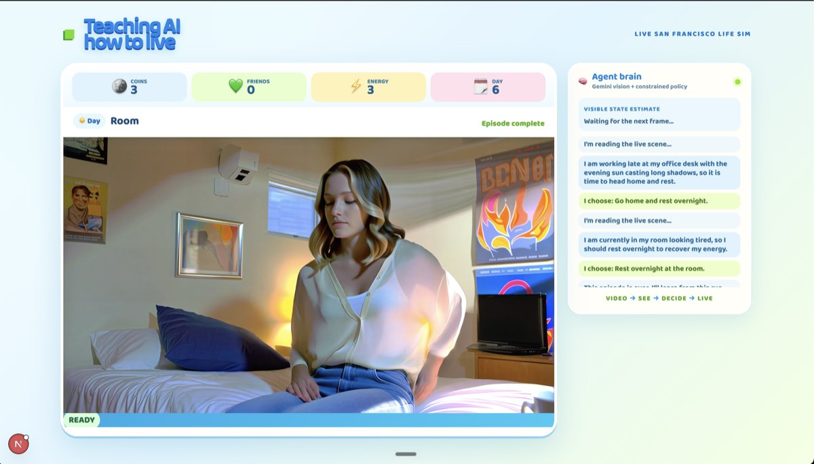

# Teaching AI How to Live

A live, closed-loop life-simulation demo built around a deterministic MDP and a real-time Orbis video world.

The video model is not the environment's source of truth. A YAML-authored MDP owns state, legal actions, rewards, and episode termination; Orbis renders that symbolic world as continuously steerable video. Gemini can inspect the live image, describe what it sees, and select from the legal action set.

## Demo

Run the app and open [http://localhost:3000/life](http://localhost:3000/life). Click **Start a new life**.

The dashboard presents a simple SF life:

- **Coins** — earned through office work
- **Friends** — built by meeting people in the park
- **Energy** — spent by work/socialising and restored at home
- **Day, time, and location** — determine legal actions

```text
Orbis frame → Gemini observes and writes a thought → constrained action choice
→ deterministic MDP transition → new Orbis steering prompt → next frame
```

The dashboard waits four initial Orbis chunks for a usable frame. Thereafter, Gemini makes one decision every 15 chunks. Legal actions appear on the video; the selected action is highlighted before the state and render change.

## Screenshots

<p align="center">
  
</p>

<p align="center">
  
  
  
</p>

## Why a deterministic MDP?

Video models are compelling renderers but weak sources of exact state, rewards, and action validity. This project deliberately splits responsibilities:

| Layer | Responsibility |
| --- | --- |
| YAML scenario | State fields, legal actions, transitions, rewards, terminal conditions, visual intents |
| MDP runtime | Validates actions and applies deterministic transitions |
| Bellman solver | Exact symbolic optimal policy for the finite scenario |
| Gemini observer | Reads a video frame, writes a visible-state estimate, and selects a legal action |
| Orbis | Renders each symbolic intent as a live video sequence |

The MDP remains authoritative even when the visual model is inconsistent. Gemini cannot invent an action or alter the true symbolic state.

## The New in SF scenario

The default scenario is [`scenarios/new-in-sf-v2.yaml`](scenarios/new-in-sf-v2.yaml):

```text
day           1–6
time          day | night
location      room | office | park
energy        0–3
money         0–3
connections   0–3
```

It is deliberately small: no more than three legal actions in a state and deterministic transitions. It is a controllable demonstration and training harness, not a claim that the policy has learned an open-ended human life.

The episode succeeds on day 6 with at least two coins and two friends. Going home automatically advances to the next day and restores energy. Each run has a stored seed that selects an initial SF visual variant without altering the symbolic initial state.

## Pages

| Page | Purpose |
| --- | --- |
| `/life` | Presentation-ready one-click closed-loop dashboard |
| `/sim-lab` | Developer view: state graph, manual actions, Bellman values, renderer/judgment controls, MP4 recording |
| `/segmentation-lab` | Real-time segmentation experiment |
| `/` | Original Orbis starter and Nano Banana kickoff demo |

## Requirements

- Node.js 20.9+
- A Reactor API key with access to `reactor/visko-orbis-stable`
- A Gemini API key for visual observation and renderer judgment

Create `.env.local` from the example:

```bash
cp .env.example .env.local
```

```dotenv
REACTOR_API_KEY=your_reactor_api_key
GEMINI_API_KEY=your_gemini_api_key
```

Keys remain server-side. The browser receives a short-lived Reactor JWT only.

## Run locally

```bash
npm install
npm run dev
```

Open [http://localhost:3000/life](http://localhost:3000/life).

Useful checks and data tools:

```bash
npm run typecheck
npm run build
npm run sim:smoke
npm run sim:collect -- 500
```

`sim:collect` is fully symbolic: it calls neither Orbis nor Gemini. It writes runs to local SQLite and exports JSONL for offline work.

## Data and recordings

Local runtime artifacts live under `data/`:

```text
data/simulation.sqlite              # runs and steps
data/episode-exports/*.jsonl        # symbolic offline-training exports
data/simulation-assets/<run-id>/    # renderer frames and recorded WebM / MP4 clips
```

The Simulation Lab records an active Orbis stream as WebM and converts it locally to H.264 MP4 using `ffmpeg`.

## Gemini and Orbis behavior

### Gemini

The dashboard makes one Gemini vision request per decision point. The Simulation Lab can also make a Gemini renderer-alignment request per action. Both share `GEMINI_API_KEY` quota.

If Gemini is unavailable or quota-limited, the runtime labels the issue and safely falls back to the exact Bellman action. The renderer still runs, but that turn is no longer a visual-inference decision. Enable billing or use an API key with sufficient quota for the full live experience.

### Orbis

Orbis is a live WebRTC renderer, not a permanently guaranteed connection. The dashboard attempts to reconnect after an unexpected transport drop. If the renderer session is terminal and cannot be restored, start a fresh life.

Only one concurrent Orbis session may be available for an account/model allocation. Disconnect active runs in the other labs before starting a new one.

## Training direction

The recommended policy path is symbolic first:

1. Use the exact Bellman solution as oracle and evaluation baseline.
2. Train a masked tabular Q-learning policy against the deterministic MDP.
3. Replace it with a small masked MLP after the tabular baseline is reliable.
4. Later, train a separate visual belief model: RGB frame → estimated symbolic state → masked policy.

Visual perception should be introduced at inference time, not conflated with reward calculation or state truth. See [TRAINING.md](TRAINING.md) for details.

## Project map

```text
scenarios/new-in-sf-v2.yaml       scenario definition
lib/sim/engine.ts                 transitions, graph enumeration, Bellman solver
lib/sim/observer.ts               Gemini frame observer + constrained decision
lib/sim/db.ts                     local SQLite persistence
app/api/sim/runs/*                run, step, observe, judge, recording routes
app/life/                         presentation dashboard
components/life-dashboard.tsx     live closed-loop UI
app/sim-lab/                      developer simulation and recording tools
hooks/use-orbis-session.ts        Orbis session, commands, and reconnect support
```

For the lower-level runtime contract, see [SIMULATION.md](SIMULATION.md).

## Original starter features

The original Orbis starter remains at `/`, including text-to-video, image-to-video, live prompt steering, pause/resume, resolution selection, and the Nano Banana kickoff example.

Useful references:

- [Visko Orbis Stable API](https://www.reactor.inc/models/visko-orbis-stable/api)
- [Gemini API billing](https://ai.google.dev/gemini-api/docs/billing)
- [Gemini API rate limits](https://ai.google.dev/gemini-api/docs/rate-limits)
