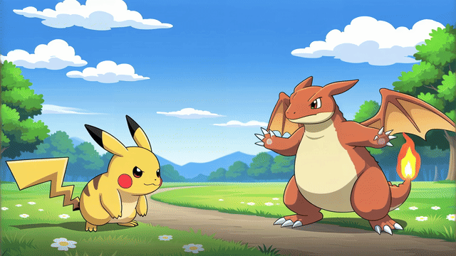
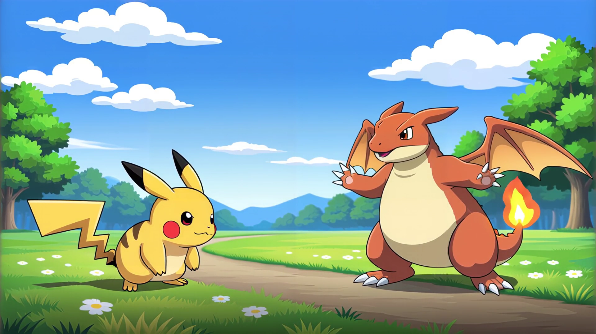
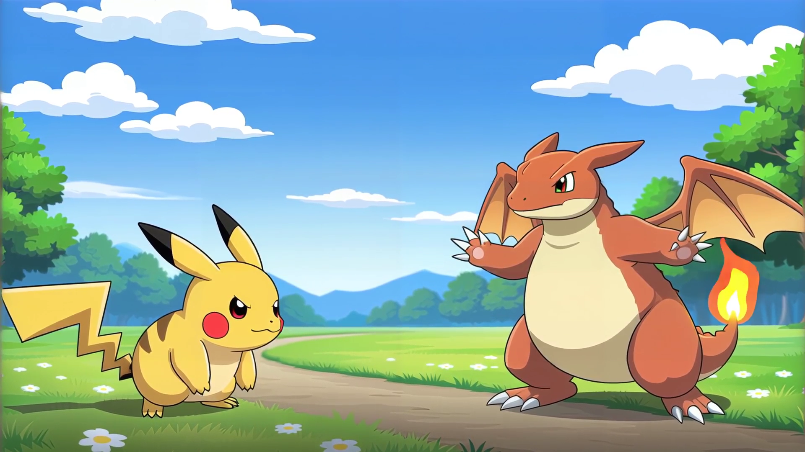
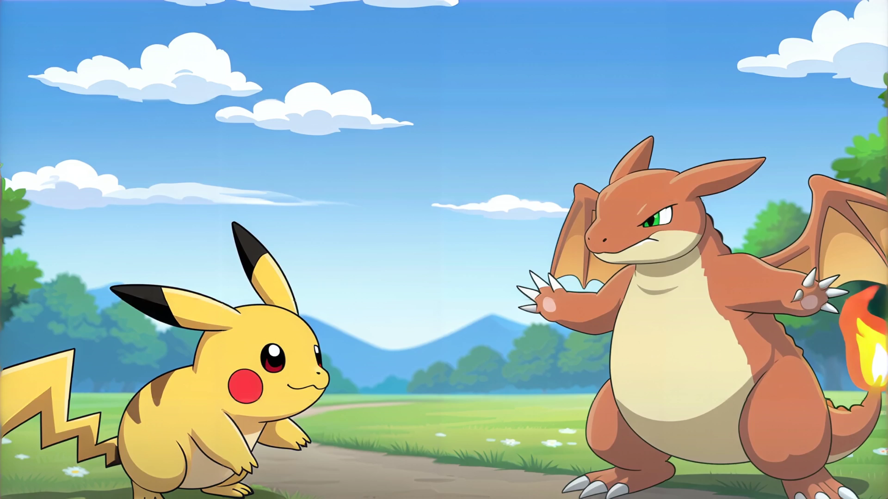
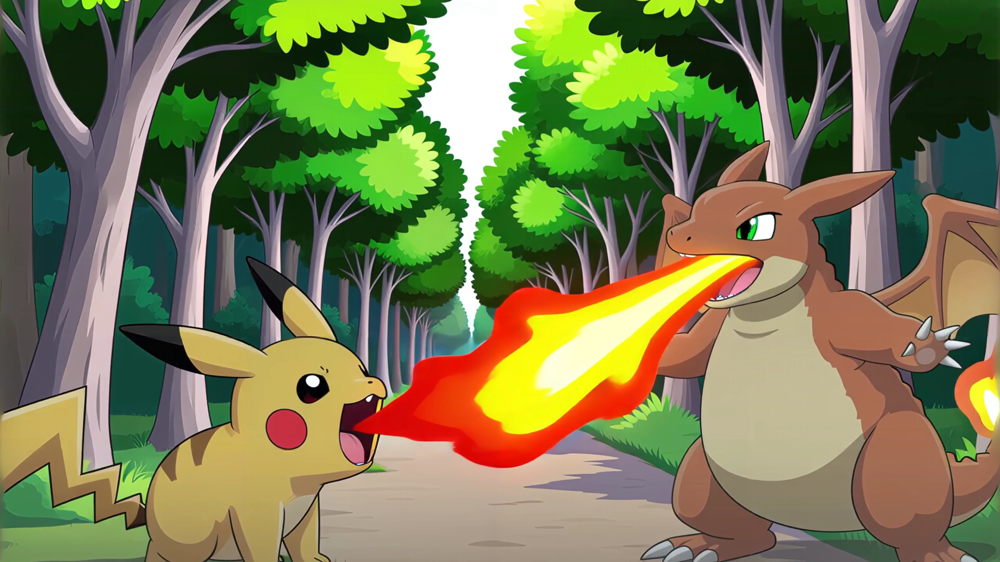
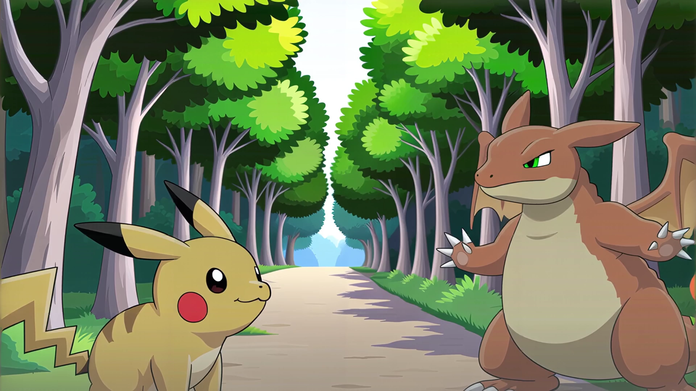

# Pokémon Battle Live: Visko Orbis Turn-Based Arena

A real-time, turn-based Pokémon battle game between Pikachu and Charizard powered by **Visko Orbis** (`reactor/visko-orbis-stable`). The entire visual battle is generated live as a continuous video stream and steered dynamically through combat prompts.

---

## Gameplay Demo

https://github.com/user-attachments/assets/demo_battle.mp4

<p align="center">
  
</p>

> Full 1080p demo recording: [`demo_battle.mp4`](demo_battle.mp4) (44 seconds, 818 live-generated Orbis frames).

---

## Features

- **100% Continuous Generative Stream:** Video is continuously generated in real-time by Visko Orbis seeded with `assets/pokemon.png`—no artificial still-image freezing or frame pausing.
- **Dynamic Prompt Steering:** Clicking attack moves dispatches concise steering prompts to the live Orbis session at chunk boundaries (`Pikachu uses Thunderbolt`, `Charizard uses Flamethrower`, `Pikachu uses Quick Attack`).
- **Zero Entity Duplication:** Resolves diffusion model character hallucination by spatially anchoring combatants on session initialization, ensuring exactly two Pokémon (Pikachu on the left, Charizard on the right) throughout the battle.
- **Dual Player Controls:** Full move pads for both Pikachu and Charizard with damage calculations, type effectiveness, and combat sound effects.
- **Visual Stance Recovery:** Automatically steers combatants back to battle-ready holding stances between attacks.
- **One-Click Arena Reset:** Re-arms Orbis with the seed image and holding position stance on `↺ Reset`.

---

## Quality Inspection & Keyframe Verification

Every keyframe of the battle was verified to maintain character consistency with zero duplicate Pokémon:

| Turn 1: Stance | Turn 2: Thunderbolt | Turn 4: Flamethrower |
| :---: | :---: | :---: |
|  |  |  |

| Turn 5: Quick Attack | Turn 6: Defeated |
| :---: | :---: |
|  |  |

---

## Quickstart

### 1. Requirements

- Python 3.10+
- `uv` (recommended) or `pip`
- Reactor API Key with access to `reactor/visko-orbis-stable`

### 2. Configure API Key

Create `.env.local` or set your environment variable:

```bash
echo "REACTOR_API_KEY=your_reactor_api_key" > .env.local
```

### 3. Launch the Battle Arena

Using `uv`:

```bash
uv run --with reactor-sdk --with pillow --with aiohttp --with numpy python pokemon_live_server.py
```

Or using standard `pip`:

```bash
pip install reactor-sdk pillow aiohttp numpy
python pokemon_live_server.py
```

Open your browser to:

```
http://localhost:8001
```

---

## Project Structure

```
.
├── pokemon_live_server.py         # Async live server (Aiohttp + WebSockets + MJPEG stream)
├── play_and_record_demo.py        # Automated test player and 1080p demo recorder
├── demo_battle.mp4                # Master 1080p recording of the live Orbis battle
├── demo_preview.gif               # Animated preview for README
├── assets/
│   └── pokemon.png                # Seed battle image (Pikachu left, Charizard right)
└── pokemon-battle/
    └── static/
        ├── index.html             # Turn-based battle UI & retro audio synthesizer
        └── demo_qc/               # Verified battle keyframes
```
