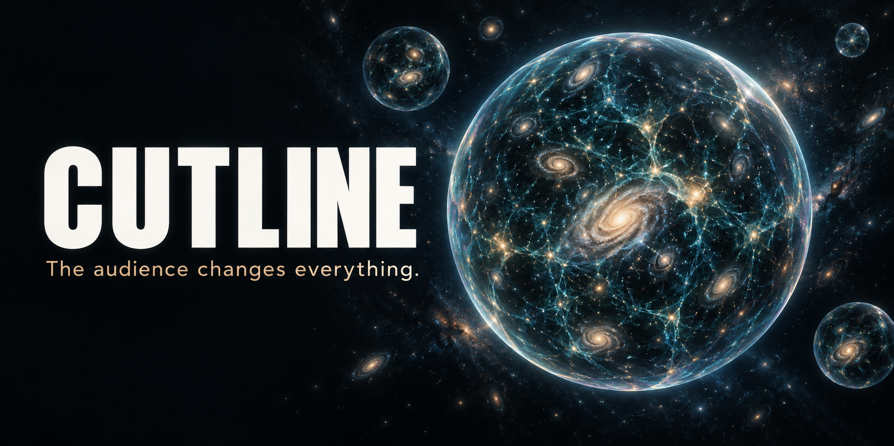
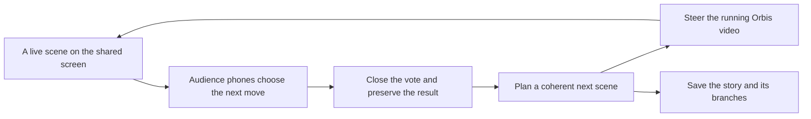
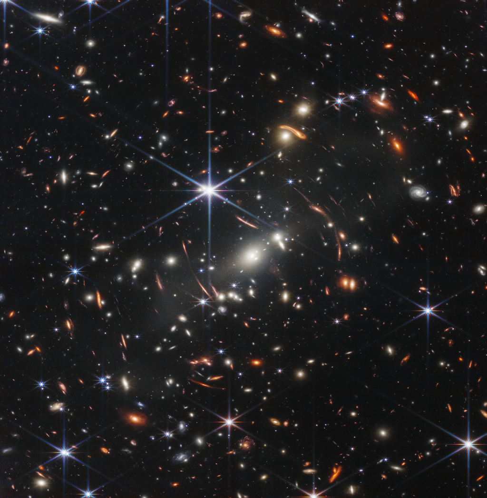
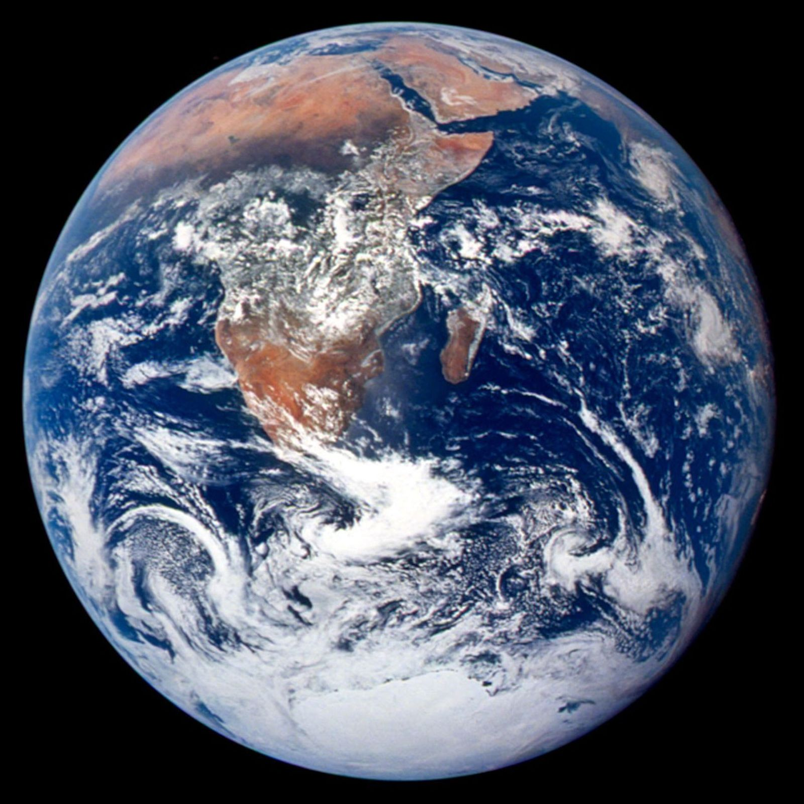
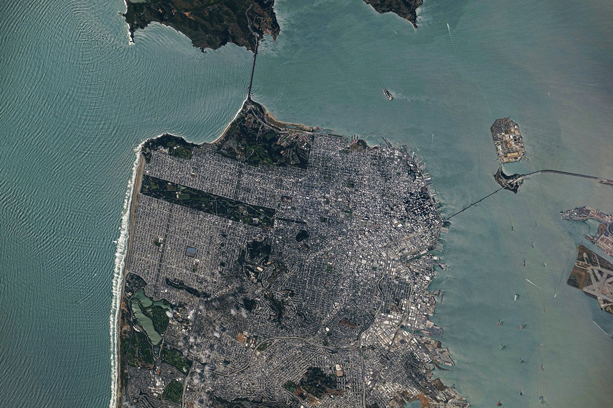

<p align="center">
  
</p>

<h1 align="center">CUTLINE</h1>
<p align="center"><strong>Live cinema. A room full of directors.</strong></p>
<p align="center">The movie is happening now. Your audience decides what happens next.</p>

<p align="center">
  <a href="#see-the-loop">See the loop</a> ·
  <a href="docs/SETUP.md">Run locally</a> ·
  <a href="ARCHITECTURE.md">Architecture</a> ·
  <a href="docs/DEMO-RUNBOOK.md">Demo runbook</a> ·
  <a href="docs/SPONSORS.md">Sponsor integrations</a>
</p>

<p align="center">
  <a href="https://vnmoorthy.github.io/cutline/"></a>
  <a href="public/demo/cutline-live.mp4"></a>
  <a href="LICENSE"></a>
</p>
<p align="center">
  
  
  
  
  
  
</p>

> **🌐 Website:** [vnmoorthy.github.io/cutline](https://vnmoorthy.github.io/cutline/) — pitch, recorded live take, and how the loop works.
> **Hackathon branch:** [`Cutline-vnmoorthy`](https://github.com/vnmoorthy/cutline/tree/Cutline-vnmoorthy) · [PowerPoint](presentation/CUTLINE-3-minute-pitch.pptx) · [Three-minute script](presentation/STORYBOARD.md) · [Complete Claude handoff](CLAUDE-HANDOFF.md) · [Review checklist](CLAUDE-REVIEW.md)
> The complete interactive app is a Cloudflare Worker with a D1 database. Run it locally in three commands, or publish your own public copy with `npm run deploy` (see [Quick start](#quick-start)).

## Quick start

```bash
git clone https://github.com/vnmoorthy/cutline.git && cd cutline
npm run install:ci && npm run build
node --import ./scripts/sites-env.mjs ./node_modules/wrangler/bin/wrangler.js d1 execute DB --local --config dist/server/wrangler.json --persist-to .wrangler/state --file drizzle/0000_magical_sway.sql
npm run dev -- --port 3000   # open http://localhost:3000
```

**Presenting?** Use `npm run demo` instead of `npm run dev`. It serves the production build on port 3000 with no hot reload, so the dev-only "server rendering errored" overlay cannot appear mid-show.

Rehearsal mode needs no API keys: create stories, vote from a second browser, apply winners, branch, and export. Copy `.env.example` to `.env.local` and add `REACTOR_API_KEY` and `NEBIUS_API_KEY` for live Orbis video and AI scene planning.

**Publish a public HTTPS copy** (audience phones need one; `localhost` on a phone points at the phone):

```bash
npx wrangler login   # one time, opens the browser
npm run deploy       # builds, creates the D1 database, applies the schema, deploys, pushes secrets from .env.local
```

The deploy prints your `https://cutline.<account>.workers.dev` URL. Put it in GitHub About, the README, and the QR slide.

## Record a product demo

Follow the [demo runbook](docs/DEMO-RUNBOOK.md) for the scripted three-minute take, then:

1. Open the deployed app on the presenter screen and create **The last train** from the story library.
2. Open the room link or QR code on two phones; vote differently; watch the tallies move live.
3. Close the vote, apply the winner, and let the room watch the next Orbis moment arrive.
4. Use the in-app recorder to capture ten seconds of the actual live media, or screen-record the full session.
5. Export the story as Markdown and JSON to show the preserved branches.

## See the loop

Mara stands inside an empty midnight train. The windows reflect teal light. An amber door waits at the end of the carriage.

Three choices appear on audience phones. Follow the light. Open the door. Pull the brake.

The director closes the vote. Cutline freezes the result, turns the winning choice into a scene direction, and sends it to the running Orbis world. The next moment is being generated as the room watches.



**The theater screen shows the video. Audience phones show the room, choices, vote totals, and winning decision.** Spectators do not receive a Reactor session credential or an independent video stream.

## What you can do

| Capability                 | What actually happens                                                                                                                                                                                      |
| -------------------------- | ---------------------------------------------------------------------------------------------------------------------------------------------------------------------------------------------------------- |
| Start live cinema          | A creator-only endpoint mints a scoped Reactor session credential; the browser receives Orbis video and audio through the Reactor SDK.                                                                     |
| Direct a visible change    | Type or **speak** what happens next ("Talk to direct the film" uses browser speech recognition and sends the direction when you stop talking), or use the four live cues. The UI distinguishes sending, provider acceptance, and the next received chunk.                                                                        |
| Invite the room            | Share a room link or QR code. Separate browser sessions can vote; a vote can be changed until voting closes.                                                                                               |
| Talk to the screen         | Audience phones have a "Talk to the film" microphone. Every finished sentence goes to the room; the director's screen merges the crowd's voices into one visible change (Nebius keeps character, setting, and storyline) and sends it to the running Orbis film by itself. The director only opens or closes the room mic. |
| Make a collective decision | Close voting, freeze tallies and the winner atomically, then apply the winning action once. Ties follow displayed choice order. Empty polls have no winner.                                                |
| Preserve continuity        | Carry character, clothing, setting, and style in editable story memory. The Nebius director receives only the active branch's recent ancestry.                                                             |
| Explore another ending     | Return to a saved scene and continue along a new branch. Alternate scenes remain in the exported story graph.                                                                                              |
| Build a cosmic opening     | Fly through a continuous 3D scene and click destinations on the canvas. Real NASA imagery is mapped into the scene: Webb's deep field fills the universe, NASA's cosmic-web simulation forms the large-scale structure, the NASA/JPL Milky Way is the galaxy disc, the SDO observation is the Sun, a NASA equirectangular map wraps Earth, and an ISS photograph is San Francisco. Orbis begins at the fictional film. |
| Rehearse without keys      | Create stories, test voting, save directions, branch, and export. Rehearsal is explicitly labeled; it does not generate video or claim an AI director call.                                                |
| Keep the result            | Export Markdown and JSON story data. During live playback, record the next ten seconds of actual media in a browser-supported video format.                                                                |

The creator's private library belongs to the current browser cookie. Room links allow their holders to read the story and participate. This release does not include account recovery or cross-device creator accounts.

### The opening has real sources

<table>
  <tr>
    <td></td>
    <td></td>
    <td></td>
  </tr>
  <tr><td>Webb · infrared composite</td><td>Earth · Apollo 17 photograph</td><td>San Francisco · ISS photograph</td></tr>
</table>

These are source frames, and the interactive flight maps them into the 3D scene: Webb's deep field sits inside the universe, NASA's cosmic-web simulation still forms the large-scale structure, the NASA/JPL Milky Way concept is the tilted galaxy disc with a scattered stellar layer for depth, the SDO 171 Å observation is the Sun, a NASA equirectangular map wraps the globe, and the ISS photograph is the San Francisco ground. Procedural stars and geometry add parallax around them; scales are cinematic, not measured. [Full credits and source records →](docs/provenance/NASA.md)

## Built for live models

| Sponsor                  | Product role                                          | Implementation                                                                                             |
| ------------------------ | ----------------------------------------------------- | ---------------------------------------------------------------------------------------------------------- |
| **Visko Orbis**          | Generates a world that can be steered as it runs      | `reactor/visko-orbis-dynamic` by default; prompt, image, generation, pause, resume, and reset controls     |
| **Reactor**              | Session authorization and live media transport        | Server-issued scoped JWT, `@reactor-team/js-sdk`, WebRTC tracks, command replies and connection statistics |
| **Nebius Token Factory** | Plans a coherent next beat with three visible choices | Server-side structured chat completion, schema validation, explicit memory, and active-branch context      |

Sponsor integrations are functional boundaries in the product. [Implementation and primary documentation →](docs/SPONSORS.md)

[Download the 10-slide PowerPoint](presentation/CUTLINE-3-minute-pitch.pptx) · [Read the three-minute speaker script](presentation/STORYBOARD.md) · [Watch the recorded Orbis take](public/demo/cutline-live.mp4)

## Run it locally

Requires Node.js **22.13 or newer** and npm. The portable development profile works on macOS, Linux, and Windows.

```sh
npm run install:ci
npm run build
node --import ./scripts/sites-env.mjs ./node_modules/wrangler/bin/wrangler.js d1 execute DB --local --config dist/server/wrangler.json --persist-to .wrangler/state --file drizzle/0000_magical_sway.sql
npm run dev -- --port 3000
```

Apply the included migration once to a fresh local database. Visit `http://localhost:3000`. Create a story and open **Connections** to enter a personal Reactor key. A Nebius key is optional for rehearsal and required for the live structured director. Personal keys remain in the current tab's memory and pass through the server to their respective provider; they are not saved with stories.

For shared presenter credentials, environment variables, local database details, and deployment preparation, follow [the setup guide](docs/SETUP.md). The checked-in `.env.example` contains names and empty values only.

## Engineering that makes the demo trustworthy

- **Story ownership:** an HttpOnly browser cookie is hashed for storage. Creator-only checks protect direction, provider tokens, exports, and deletion.
- **Consistent voting:** a conditional vote upsert prevents late votes; one SQL update closes the poll and freezes its result.
- **Concurrent edits:** story writes compare the current version. Conflicting edits return a retryable `409` rather than overwrite a newer story.
- **Room synchronization:** server-sent events provide fresh snapshots and reconnect after a bounded stream lifetime.
- **Visible provenance:** saved beats identify opening, rehearsal, or Nebius origin, and keep video delivery status separate from the text plan.
- **Recoverable failures:** provider errors surface to the creator; the story remains available for another direction, export, or reconnection.

[Detailed data flow, lifecycle, API, and failure boundaries →](ARCHITECTURE.md)

## Verification and limits

The pre-release API run recorded **210 passing assertions across 12 groups**, including independent browser identities, voting races, branch ancestry, export authorization, deletion, and SSE reconnection after more than 25 seconds. A further regression run passed **62 assertions across eight tests**; six focused story-logic tests and a production build also passed. These are historical local results; rerun the commands below against the final checkout. Evidence for the original integration run is in [API results](docs/testing/api-results.json) and [SSE evidence](docs/testing/sse-evidence.json).

```sh
npm run typecheck
npm run lint
npm test
CUTLINE_TEST_BASE=http://localhost:3000 npm run test:integration
npm run build
```

The integration suite requires a running local server, explicitly requests rehearsal planning, and does not spend sponsor credits. It uses isolated cookie sessions and removes its own test stories.

A real Orbis session was observed delivering **2560 × 1440 video at 18 fps**. One measured cue was acknowledged after **1,642 ms**; a subsequent `chunk_complete` event arrived after **3,464 ms**. That is a single observed session, not a latency guarantee. A command acknowledgement or chunk event does not prove that every visual detail followed the prompt. Nebius returned a schema-valid scene and three choices through the application in **3.63 seconds**, preserving character, setting, memory, and ancestry. This is one observed request using `openai/gpt-oss-120b`, not a latency guarantee. [Redacted live evidence](docs/testing/nebius-live.json).

Branching preserves story structure and written continuity; it regenerates video from a saved prompt. It is **not exact video rewind**. The cosmic opening is a continuous cinematic 3D flight with clickable destinations; scales and distances are compressed. It is a visualization, not astronomical footage or a physically exact flight. Orbis generates the fictional movie after the opening. [Verification details and release checks →](docs/VERIFICATION.md)

## Project map

```text
app/                            Studio, audience route, and HTTP endpoints
components/cutline/             Creator and audience UI; story and live-video hooks
lib/cutline/                    Story model, director, storage helpers, reference metadata
lib/cutline/orbis/starter.ts    Attributed official Orbis starter adaptation
db/schema.ts                    D1 / Drizzle schema
drizzle/                        Versioned SQL migrations
build/reactor-vite-plugin.ts    Serves the SDK's paired JavaScript/WASM assets
tests/                          Focused unit tests and isolated API integration suite
public/images/                  Product artwork and attributed reference frames
docs/                           Setup, demo, sponsor, verification, and provenance guides
```

## Source, artwork, and credit

Built for the [Live Models Hackathon hosted by Visko × Reactor × Nebius](https://luma.com/gh4256ju). Cutline uses the [official Orbis hackathon starter](https://github.com/Visko-Platform/orbis-hackathon-starter) at commit `6de7ad733e90967f25979afcfca55b73a71f064a` for attributed message helpers and lifecycle patterns. That upstream commit has no declared license; its adapted material is not represented as Cutline-authored or relicensed under a blanket MIT claim. See [starter provenance](docs/STARTER.md).

Science reference frames come from NASA, ESA, CSA, STScI, JPL-Caltech, and credited scientific contributors. They include real observations, a scientific simulation, and an artist concept. The fictional multiverse, train keyframe, and repository banner are generated Cutline artwork. NASA receives credit for the original-source opening; Orbis footage belongs to the separately labeled fictional film. See [NASA provenance](docs/provenance/NASA.md), [artwork notes](docs/ASSETS.md), and [source notices](docs/PROVENANCE.md).

Contributions should follow [CONTRIBUTING.md](CONTRIBUTING.md). Public deployment, an organizer submission branch, and a social announcement are separate release steps tracked in [the submission guide](docs/SUBMISSION.md).
