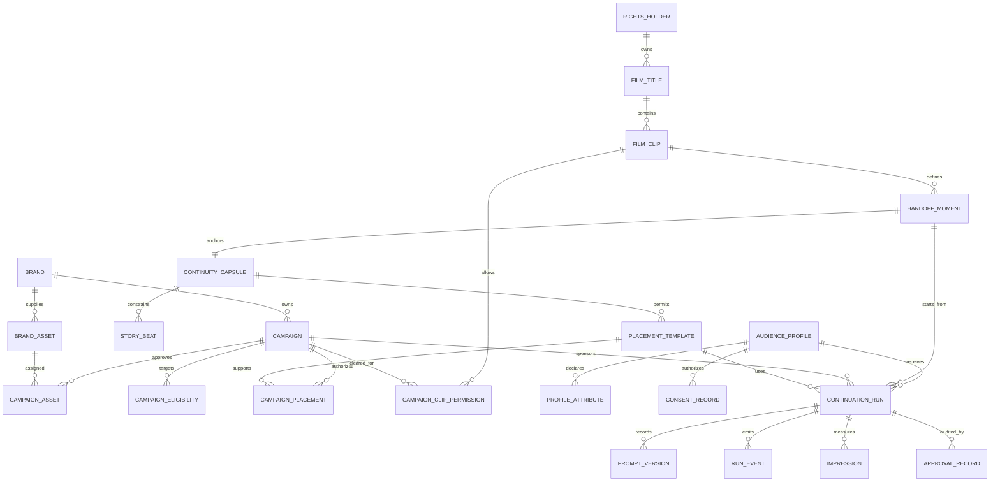

# Dynamic Product Placement Studio for Licensed Film Moments

## Summary

Build a studio-operator platform that lets rights holders ingest an approved
movie clip, identify a safe handoff moment, accept real sponsor assets, and
launch a sponsor-specific live continuation of the film.

The hackathon demo plays a licensed clip to a designated handoff frame, then
uses that approved 16:9 final frame plus structured continuity information to
have Orbis continue the same moment in real time with a naturally embedded
sponsor. It is a reusable platform for many films and brands, not a bespoke
scene generator.

## Product experience

### Studio operator workflow

1. Create a film title and register a licensed clip with runtime, aspect ratio,
   rights window, territory, and rights-holder metadata.
2. Select a handoff timestamp near a visual transition or moment of motion.
   Extract a 16:9 handoff frame.
3. Create a Continuity Capsule that records the location, characters,
   wardrobe, camera, lighting, visible objects, immediate story objective, and
   protected or disallowed changes.
4. Define allowed placement templates, such as storefronts, vehicles,
   packaging, drinks, posters, phone screens, or background signage.
5. Onboard a brand campaign with approved logo, product, packaging, and brief;
   map it to permitted clips, territories, audience segments, dates, and
   placement templates.
6. Select a consented demo profile. The server chooses the highest-priority
   eligible campaign, or an unbranded fallback when none qualify.
7. Generate a grounded, immutable continuation prompt from the handoff frame,
   Continuity Capsule, selected campaign asset, and placement template.
8. Start the Orbis live continuation. Operators can choose only pre-approved
   story beats; each beat preserves the selected sponsor and continuity rules.
9. Record approvals, prompt versions, model lifecycle events, placement
   checkpoints, and impressions in an audit trail.

### Hackathon demo

Use one approved cinematic clip with a clean exit shot and strong final 16:9
frame. The demo plays the original clip, switches among three consented profile
cards, explains the campaign choice, launches a live sponsor-integrated
continuation, applies one approved story beat, and displays the audit trail.

## Technical design

- Extend the Next.js starter into Studio, Brand Portal, Playback Console, and
  Audit Ledger modules.
- Store structured data in PostgreSQL via Prisma and video/source assets in
  object storage.
- Use a media-processing worker to validate clips, generate contact sheets,
  extract the handoff frame, and pre-crop it to 16:9.
- Keep Reactor and Gemini keys server-side. Use the existing image upload,
  `set_image`, `set_prompt`, and `start` command path for every continuation.
- Generate prompts server-side and persist each version once a run starts.
- Restrict browser steering to studio-defined story beat IDs; do not accept raw
  prompts or campaign changes during a run.
- Select campaigns server-side using active rights, clip permission, territory,
  approved asset/template, audience-profile rules, frequency cap, priority,
  then deterministic ID tie-break.

## API boundaries

- `POST /api/titles`, `POST /api/clips`, and
  `POST /api/clips/:id/handoff-frame`
- `POST /api/continuity-capsules` and `POST /api/placement-templates`
- `POST /api/brands/:id/assets`, `POST /api/campaigns`, and
  `POST /api/campaigns/:id/approve`
- `GET /api/continuations/eligible?clipId&profileId`
- `POST /api/continuations` to lock an approved selection and create a run
- `POST /api/continuations/:id/prepare` to produce the grounded prompt
- `POST /api/continuations/:id/start` to start the Orbis session
- `POST /api/continuations/:id/steer` to submit a predefined story beat
- `POST /api/continuations/:id/events` to record playback and model events

## Data model

Core entities: `RightsHolder`, `FilmTitle`, `FilmClip`, `HandoffMoment`,
`ContinuityCapsule`, `PlacementTemplate`, `StoryBeat`, `Brand`, `BrandAsset`,
`Campaign`, `AudienceProfile`, `ContinuationRun`, `PromptVersion`, `RunEvent`,
`Impression`, and `ApprovalRecord`.

## Verification

- Validate ingestion, handoff-frame extraction, and 16:9 pre-cropping.
- Reject runs without approved rights, campaign/template permission, asset, or
  audit approval.
- Test selection rules for expiry, territory, campaign cap, missing asset,
  disallowed clip, and unbranded fallback.
- Reject raw client prompts, sponsor changes during a run, and unapproved beats.
- Verify Orbis image acceptance, ready state, start, chunk events, steering,
  errors, reset, and disconnect behavior.
- Rehearse: original clip, selected handoff, live continuation, one story beat,
  and complete audit trail.

## Assumptions

- Rights holders supply approved clips and all commercial permissions.
- The first demo contains one approved clip, three real-brand campaigns, three
  consented simulated profiles, and a small approved template/beat set.
- The platform is clip-to-live continuation, not frame-accurate modification
  of an already encoded source clip. A future inpainting/compositing provider
  can use the same handoff, continuity, and placement records.
